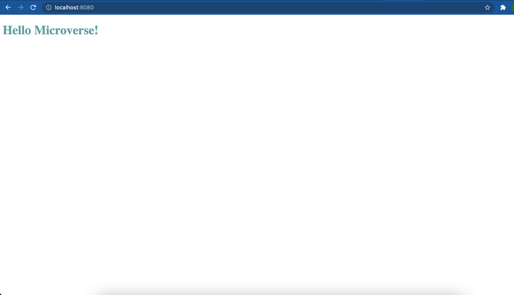

# Hello-Microverse

> This project's purpose is to get familiar with basic version controlling on git and Github in addition to Linters code cleaner. In this project, I try to be familiar with both version controlling and clean code writing with the help of Linter.

Additional description about the project and its features.

## Built With

- HTML
- CSS
- Linters used for code cleaning

## Live Demo

[Live Demo Link](https://mihreteab.github.io/Hello-World/)

## Getting Started

**This is an example of how you may give instructions on setting up your project locally.**
**Modify this file to match your project, remove sections that don't apply. For example: delete the testing section if the currect project doesn't require testing.**

To get a local copy up and running follow these simple example steps.

### Prerequisites
    - node
    - HTML
    - CSS
    - npm
    - linter

### Setup
  ##### clone the project
  
  `clone https://github.com/mihreteab/Hello-World.git`
  
  ##### open project directory
  
  `cd Hello-World`
  

### Install

  `npm install`
  

### Usage

### Run tests

### Deployment

## Author

👤 **Mihreteab Demeke**

- GitHub: [@githubhandle](https://github.com/mihreteab)
- Twitter: [@twitterhandle](https://twitter.com/0ef629d0f6ee440)
- LinkedIn: [LinkedIn](https://www.linkedin.com/in/mihreteab-demeke-46a718140/)

## 🤝 Contributing

Contributions, issues, and feature requests are welcome!

Feel free to check the [issues page](../../issues/).

## Show your support

Give a ⭐️ if you like this project!

## Acknowledgments

- Hat tip to anyone whose code was used
- Inspiration
- etc

## 📝 License
none
